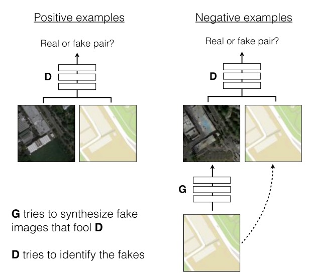
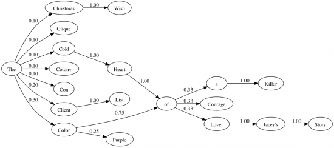
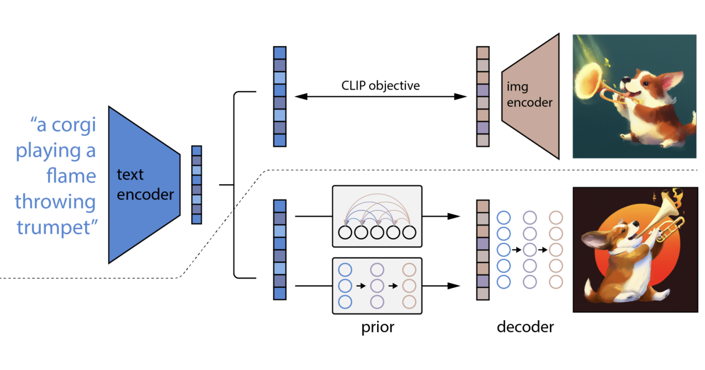
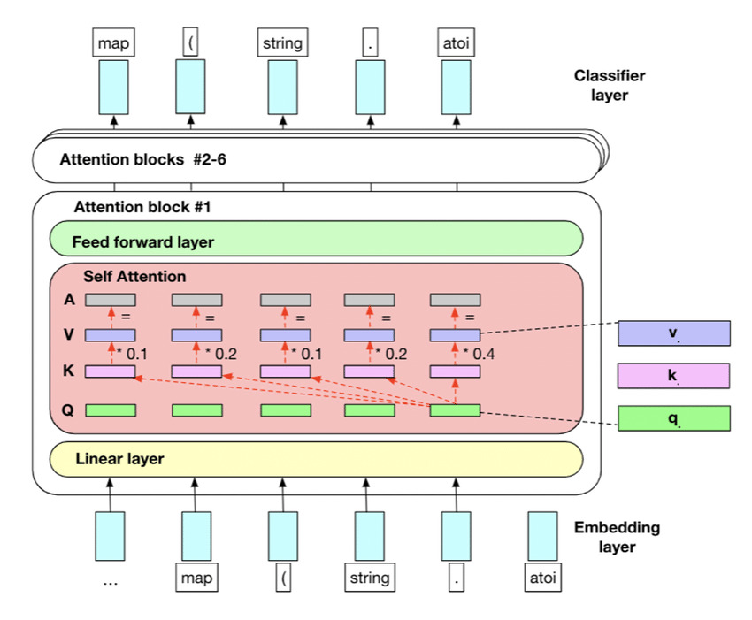

# 🧠 Mini GenAI Projects Collection

This repository contains **4 mini Generative AI projects** built to explore different aspects of text and image generation.  
Each project highlights a unique model/approach in the AI domain, covering **GANs, Markov Chains, Pre-trained Transformers, and Text-to-Image models**.  

## ⚡ Training Environment

All projects were trained and executed using **Google Colab** with access to **GPU** and **TPU** accelerators for faster training and inference.  

---

## 📌 Projects Overview  

### 1. 🎨 Pix2Pix GAN – Image-to-Image Translation
- **Description:**  
  Implemented **Pix2Pix GAN**, a conditional Generative Adversarial Network used for **image-to-image translation** tasks such as sketch → photo, edges → object, etc.  
  The model uses a **U-Net Generator** and a **PatchGAN Discriminator** to generate realistic outputs from input images.  

- **Key Highlights:**
  - Generator learns mapping from input image to output.
  - Discriminator ensures outputs look realistic.
  - Example applications: Colorization, Super-resolution, Object conversion.

- **Model Architecture:**  
  

---

### 2. 🔗 Markov Chain Text Generator
- **Description:**  
  A **Markov Chain-based text generator** that predicts the next word using probability distributions from a given corpus.  
  Unlike neural networks, this method relies on simple **n-gram transitions**.  

- **Key Highlights:**
  - Captures sequential word probabilities.
  - Useful for building simple text generation bots.
  - Shows the fundamentals of probabilistic text modeling.

- **Model Illustration:**  

---

### 3. 🖼️ DALL·E + Qwen (Text-to-Image Generation)
- **Description:**  
  Integrated **DALL·E** and **Qwen models** to generate images from natural language prompts.  
  Demonstrates how **multimodal AI** works by converting text into visual content.  

- **Key Highlights:**
  - Input: natural language prompt (e.g., "A futuristic city on Mars").
  - Output: AI-generated high-quality image.
  - Combines creativity with AI understanding of language + vision.

- **Model Example:**  

---

### 4. 📝 Pre-trained GPT-2 (Text Generation)
- **Description:**  
  Used **GPT-2**, a transformer-based language model by OpenAI, to generate text from prompts.  
  GPT-2 is known for its ability to produce **coherent, context-aware text**.  

- **Key Highlights:**
  - Works on the **Transformer Decoder architecture**.
  - Trained on massive internet text data.
  - Generates essays, stories, conversations, and more.

- **Model Architecture:**  
 

---

## 🚀 Tech Stack
- **Languages:** Python  
- **Frameworks & Libraries:** PyTorch, TensorFlow/Keras, Transformers, OpenAI API  
- **Models Used:** Pix2Pix GAN, Markov Chain, DALL·E, Qwen, GPT-2  

----

## Use Goole Colab for High Level Of GPU's
---

## ✨ Future Scope
- Expand to **Stable Diffusion** and **GPT-4** experiments.  
- Explore fine-tuning on custom datasets.  
- Combine text + image + audio generation into a single pipeline.  

---

## 📌 Author
👨‍💻 **Akhil Appaso Shinde**  
Exploring the world of **Generative AI** with small but powerful projects 🚀  

